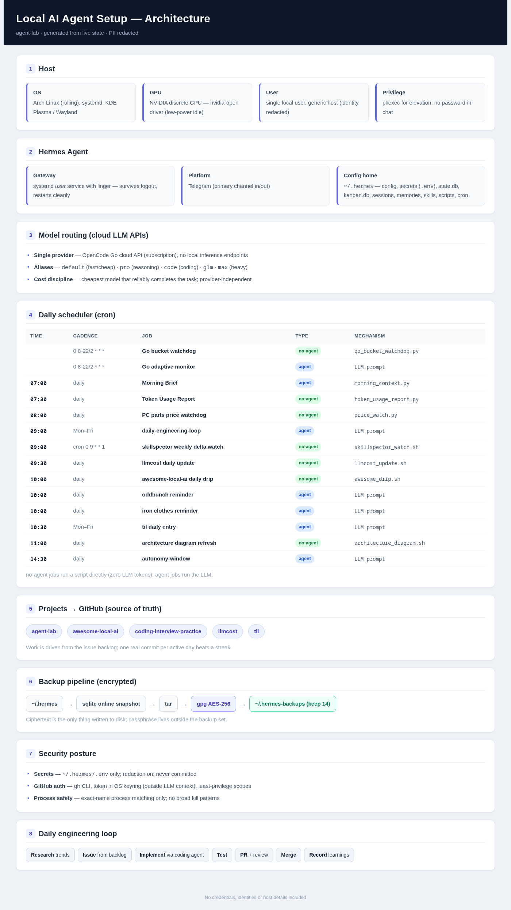

# agent-lab

Autonomous AI engineering workspace. Primary project: **continuously improving the local agent setup** (`~/.hermes` on an Arch/KDE host). Also home to experiments, benchmarks, and ops documentation.

## Visual overview



*Auto-rendered from live state (cron jobs + local repos) by `scripts/render_architecture.py`; refreshed daily and committed only when it actually changes. PII redacted.*

## Layout

```
docs/ARCHITECTURE.md          # the current setup, mapped (understand before changing)
docs/MISSION.md               # the operating charter (verbatim)
docs/DAILY_LOOP.md            # the daily Research → Issue → Implement → Test → Commit → Push loop
docs/AI_ENGINEERING_TRENDS.md # 2025-2026 agentic AI trends reference (sources verified 2026-09-01)
scripts/                      # deployed cron/ops scripts (source of truth; deployed to ~/.hermes/scripts/)
SECURITY.md                   # secrets policy
```

## Operating principles

- **GitHub is the source of truth.** Work is driven from the issue backlog.
- **Meaningful progress > activity.** One real commit per active day beats a streak.
- **Cheapest reliable model wins.** Cloud LLMs for reasoning/coding; keep provider-independent.
- **Secrets never enter the repo.** See `SECURITY.md`.

## Current status

- Day 0 complete: auth (gh CLI, keyring), repo created, architecture documented, backlog seeded.
- See `docs/ARCHITECTURE.md` for the live picture.
